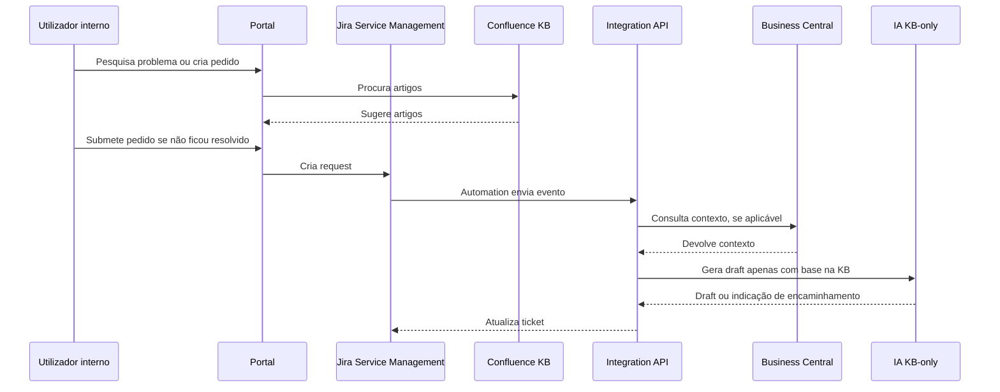
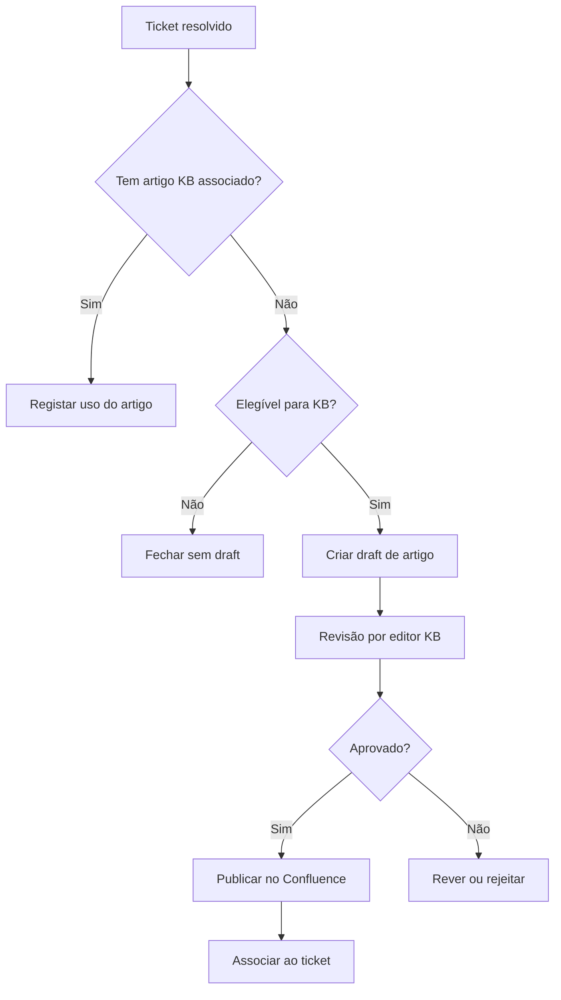
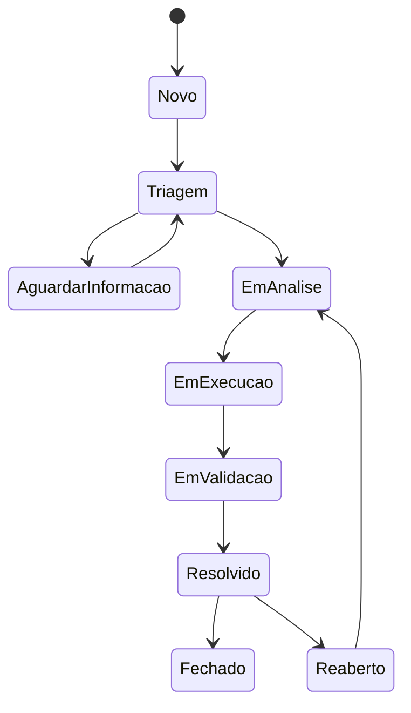

# Fluxos principais

## Criação de pedido

```mermaid
sequenceDiagram
    participant U as Utilizador interno
    participant P as Portal
    participant J as Jira Service Management
    participant K as Confluence KB
    participant X as Integration API
    participant B as Business Central
    participant AI as IA KB-only

    U->>P: Pesquisa problema ou cria pedido
    P->>K: Procura artigos
    K-->>P: Sugere artigos
    U->>P: Submete pedido se não ficou resolvido
    P->>J: Cria request
    J->>X: Automation envia evento
    X->>B: Consulta contexto, se aplicável
    B-->>X: Devolve contexto
    X->>AI: Gera draft apenas com base na KB
    AI-->>X: Draft ou indicação de encaminhamento
    X-->>J: Atualiza ticket
```

## Evolução da KB

```mermaid
flowchart TD
    A[Ticket resolvido] --> B{Tem artigo KB associado?}
    B -->|Sim| C[Registar uso do artigo]
    B -->|Não| D{Elegível para KB?}
    D -->|Não| E[Fechar sem draft]
    D -->|Sim| F[Criar draft de artigo]
    F --> G[Revisão por editor KB]
    G --> H{Aprovado?}
    H -->|Sim| I[Publicar no Confluence]
    H -->|Não| J[Rever ou rejeitar]
    I --> K[Associar ao ticket]
```

## Lifecycle

```mermaid
stateDiagram-v2
    [*] --> Novo
    Novo --> Triagem
    Triagem --> AguardarInformacao
    AguardarInformacao --> Triagem
    Triagem --> EmAnalise
    EmAnalise --> EmExecucao
    EmExecucao --> EmValidacao
    EmValidacao --> Resolvido
    Resolvido --> Fechado
    Resolvido --> Reaberto
    Reaberto --> EmAnalise
```
