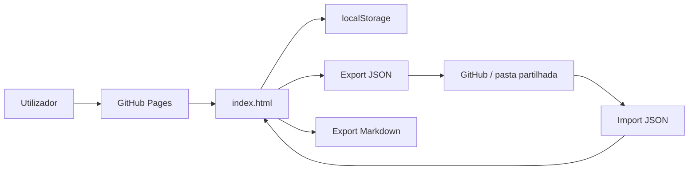
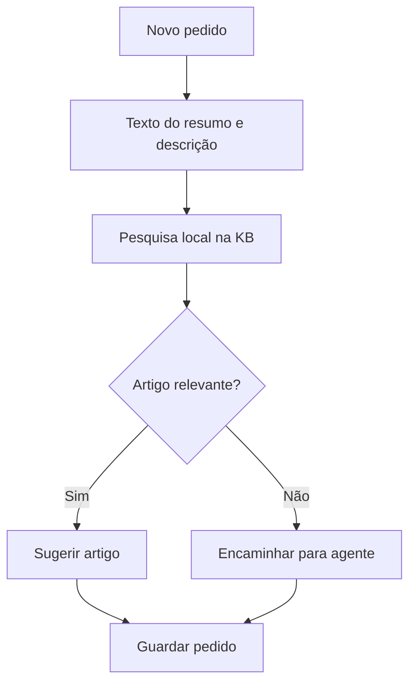

# Arquitetura GitHub Pages

## Decisão

A versão simplificada da ApoioBusinessCentral passa a ser uma aplicação 100% estática.

## Componentes

| Componente | Tecnologia | Função |
|---|---|---|
| Interface | HTML/CSS/JavaScript | App principal. |
| Hosting | GitHub Pages | Publicação da app. |
| Persistência | localStorage | Dados guardados no browser. |
| Exportação | JSON/Markdown | Backup e partilha manual. |
| Sugestões KB | Scoring local | Pesquisa sem IA externa. |

## Diagrama

## Fluxo de pedido

## Implicação

Esta abordagem é ideal para um primeiro protótipo funcional porque:

- não exige infraestrutura;
- não exige orçamento adicional;
- não exige tokens;
- não expõe segredos;
- permite validar o modelo funcional antes de integrar Jira/Confluence/BC.
